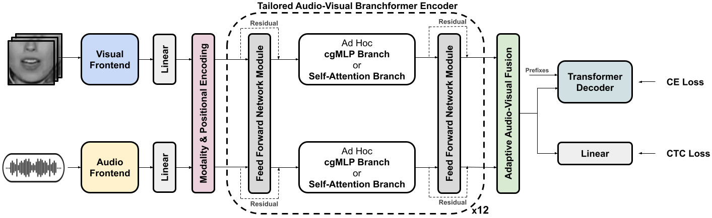
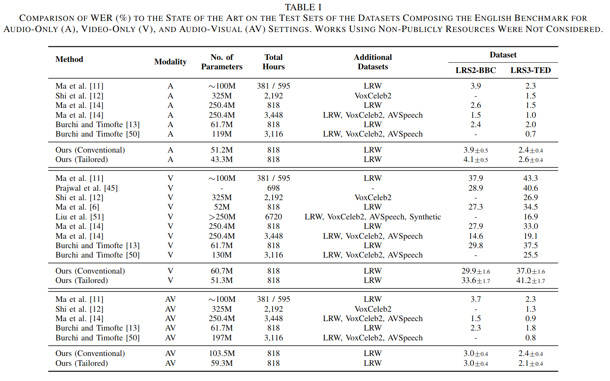

<h1 align="center"><span style="font-weight:normal">Tailored Design of Audio-Visual<br />Speech Recognition Models using Branchformers</h1>  

  <div align="center">
    
[David Gimeno-Gómez](https://scholar.google.es/citations?user=DVRSla8AAAAJ&hl=en), [Carlos-D. Martínez-Hinarejos](https://scholar.google.es/citations?user=M_EmUoIAAAAJ&hl=en)
</div>

<div align="center">
  
[📘 Introduction](#intro) |
[🛠️ Preparation](#preparation) |
[💪 Training](#training) |
[🔮 Inference](#inference) |
[📊 Results](#results) |
[🦒 Model Zoo](#modelzoo) |
[📖 Citation](#citation) |
[📝 License](#license)
</div>

## <a name="intro"></a> 📘 Introduction

<div align="center">  </div>

**Abstract.** _Recent advances in Audio-Visual Speech Recognition have led to unprecedented achievements in the field, improving the robustness of this type of system in adverse, noisy environments. In most cases, this task has been addressed through the design of models composed of two independent encoders, each dedicated to a specific modality. However, while recent works have explored unified audio-visual encoders, determining the optimal cross-modal architecture remains an ongoing challenge. Furthermore, such approaches often rely on models comprising vast amounts of parameters and high computational cost training processes. In this paper, we aim to bridge this research gap by introducing a novel audio-visual framework. Our proposed method constitutes, to the best of our knowledge, the first attempt to harness the flexibility and interpretability offered by encoder architectures, such as the Branchformer, in the design of parameter-efficient AVSR systems. To be more precise, the proposed framework consists of two steps: first, estimating audio- and video-only systems, and then designing a tailored audio-visual unified encoder based on the layer-level branch scores provided by the modality-specific models. Extensive experiments on English and Spanish AVSR benchmarks covering multiple data conditions and scenarios demonstrated the effectiveness of our proposed method. Results reflect how our tailored AVSR system reaches state-of-the-art recognition rates while significantly reducing the model complexity w.r.t. the prevalent approach in the field._

## <a name="preparation"></a> 🛠️ Preparation

- Prepare the **conda environment** to run the experiments:

```
conda create -n tailored-avsr python=3.8
conda activate tailored-avsr
pip install -r requirements.txt
```

- Get access to your **dataset of interest**, preprocessing and saving the data in the following structure:
  
```
LIP-RTVE/
├── WAVs/
│   ├── speaker000/
│   │   ├── speaker000_0000.wav
│   │   ├── speaker000_0001.wav
│   │   ├── ...
│   ├── speaker001/
│   │   ├── ...
│   ├── ...
├── ROIs/
│   ├── speaker000/
│   │   ├── speaker000_0000.npz
│   │   ├── ...
│   ├── ...
├── transcriptions/
│   ├── speaker000/
│   │   ├── speaker000_0000.txt
│   │   ├── ...
│   ├── ...
```

⚠️ **Warning:** Please place the data in the directory `../data/`. If not, you should modify the paths specified in the corresponding CSV split files, e.g., `splits/training/speaker-independent/liprtve.csv`.

## <a name="training"></a> 💪 Training

The following command represents a fine-tuning and inference of an English AVSR system to the Spanish LIP-RTVE dataset among other details:

```
python avsr_main.py \
  --training-dataset ./splits/training/speaker-independent/liprtve.csv \
  --validation-dataset ./splits/validation/speaker-independent/liprtve.csv \
  --test-dataset ./splits/test/speaker-independent/liprtve.csv \
  --config-file ./configs/AVSR/conventional_transformer+ctc_english.yaml \
  --load-checkpoint ./model_checkpoints/avsr/avsr_english.pth \
  --mode both \
  --output-dir ./exps/fine-tuning/LIP-RTVE/ \
  --output-name test-liprtve-si-finetuned-from-english \
  --yaml-overrides training_settins:batch_size:8
```

## <a name="inference"></a> 🔮 Inference

Once we have estimated a model we can perform more inference processes, e.g., incorporating a Language Model during beam search:

```
python avsr_main.py \
  --test-dataset ./splits/test/speaker-independent/liprtve.csv \
  --config-file ./configs/AVSR/conventional_transformer+ctc_english.yaml \
  --load-checkpoint ./exps/fine-tuning/LIP-RTVE/models/model_average.pth \
  --mode inference \
  --lm-config-file ./configs/LM/lm-spanish.yaml \
  --load-lm ./model_checkpoints/lm/english.pth \
  --output-dir ./exps/fine-tuning/LIP-RTVE/ \
  --output-name test-liprtve-si-finetuned-from-english+lm \
```

## <a name="modelzoo"></a> 🦒 Model Zoo

The model checkpoints for audio-only, video-only, and audio-visual settings are publicly available in our official Zenodo repository. Please, click [here](https://zenodo.org/records/11441180]) to download the checkpoints along with their corresponding configuration files. By following the instructions indicated above for both training and inference, you will be able to evaluate our models and also fine-tune them to your dataset of interest.

## <a name="results"></a> 📊 Results

<div align="center">  </div>

Detailed discussion on these results and those achieved for the Spanish VSR benchmark can be found in our [paper]()!

## <a name="citation"></a> 📖 Citation

The paper is currently under review for the IEEE/ACM Transactions on Audio, Speech, and Language Processing (TASLP) journal.

```
@article{gimeno2025tailored,
  author={Gimeno-G{\'o}mez, David and Carlos-David},
  title={{Tailored Design of Audio-Visual Speech Recognition Models using Branchformers}},
  journal={},
  volume={},
  pages={}
  year={},
  publisher="",
}
```

## <a name="license"></a> 📝 License

This work is protected by [CC BY-NC-ND 4.0 License (Non-Commercial & No Derivatives)](LICENSE)
